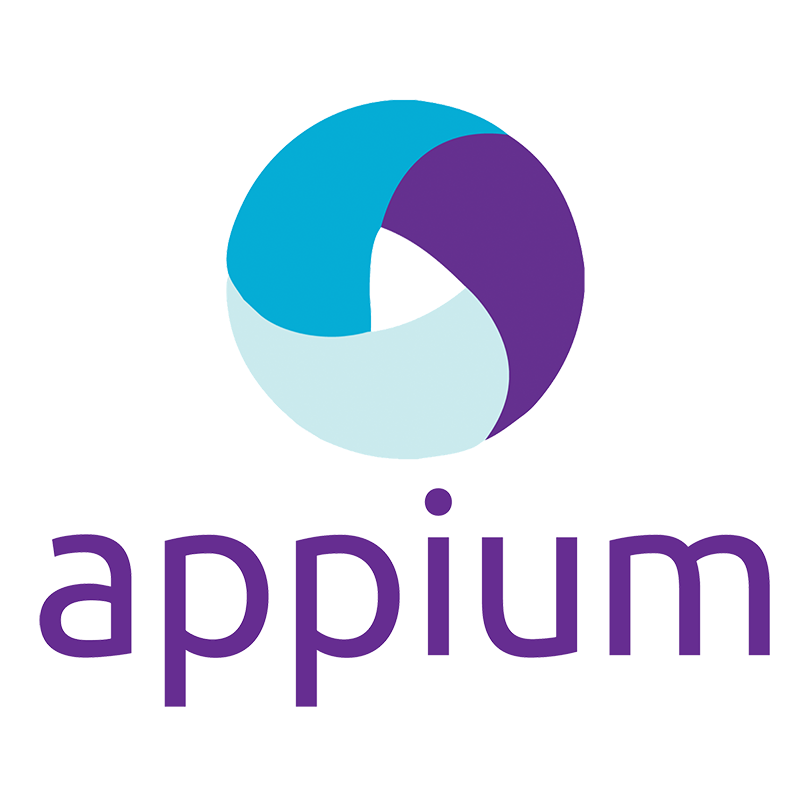

  

<h1 align="center">Welcome to my GitHub</h1>

### About me

- 🧪 QA Automation Engineer & Backend Developer experienced in test automation, CI/CD pipelines, serverless architectures, and API integrations.
- 💻 Proficient in Python, Java, Playwright, and Selenium, with a focus on building scalable and reliable systems on AWS.
- 💊 Pharmacy background reinforcing a quality-first mindset: documentation rigor, traceability, and adherence to standards applied to QA workflows.

---

### Experience

* **🚀 Backend:** Designed serverless chatbots and automated financial reporting systems that reduced manual data entry by centralizing business data across multiple platforms.
* **⚙️ Test Automation:** Built scalable Playwright-based frameworks using Page Object Model (POM) design and Allure reporting to validate critical e-commerce paths for client websites.
* **🤖 AI & Data Quality:** Improved LLM code reliability by designing acceptance tests in Dockerized environments. Currently architecting an advanced **AI Testing Framework** that leverages custom-crafted skills, rules, and workflow pipelines to automate complex validation scenarios.

---

### Tech stack

#### Communication

  &nbsp;&nbsp;

#### Programming Languages

  &nbsp;&nbsp;&nbsp;&nbsp;

#### Automation & Frameworks

  &nbsp;&nbsp;&nbsp;&nbsp;&nbsp;&nbsp;&nbsp;&nbsp;

#### QA Management & Tools

  &nbsp;&nbsp;&nbsp;&nbsp;&nbsp;&nbsp;&nbsp;&nbsp;

#### Infrastructure & CI/CD

  &nbsp;&nbsp;&nbsp;&nbsp;&nbsp;&nbsp;&nbsp;&nbsp;

#### Databases

  &nbsp;&nbsp;

---

<h3 align="center">Let's connect!</h3>

  

---

  

