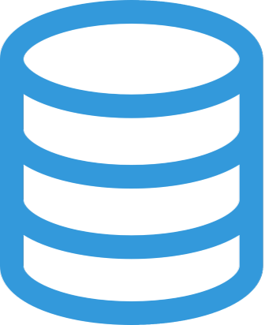
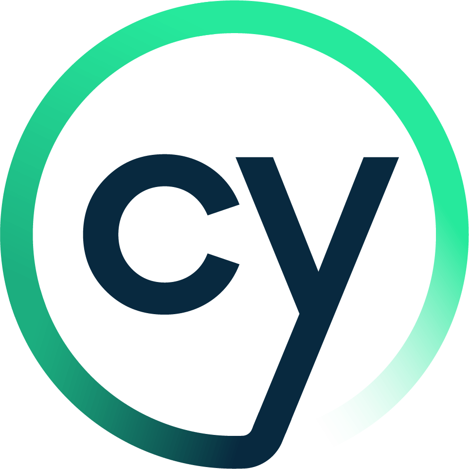
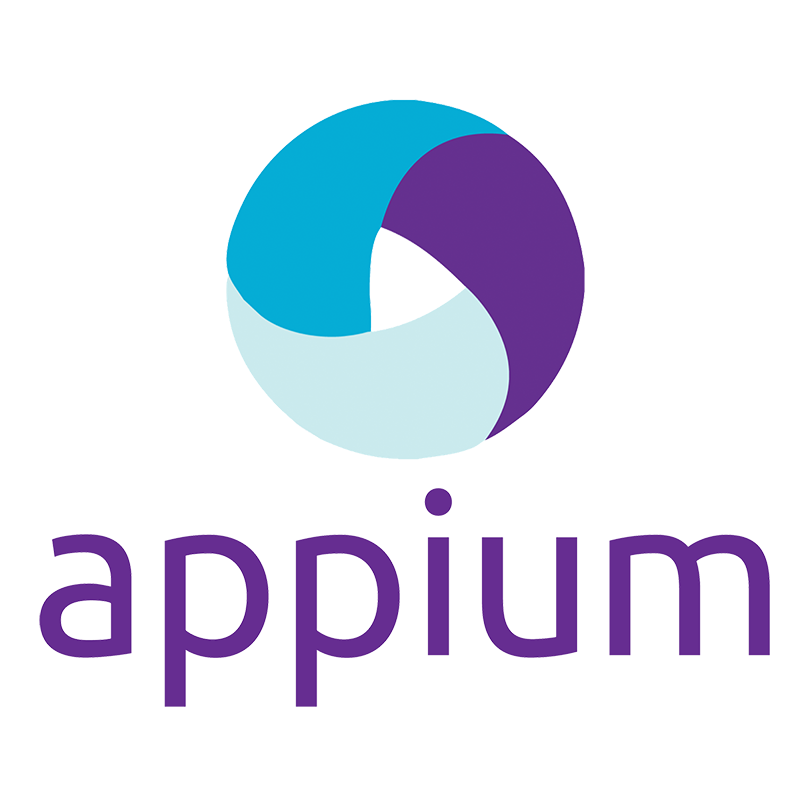

  

<h1 align="center">Welcome to my GitHub</h1>

### About me

- 🧪 SDET / QA Automation Engineer experienced in test automation, manual and exploratory testing, CI/CD pipelines, API testing, E2E testing, and AI-assisted testing.
- 💻 Proficient in Python, JavaScript, Playwright, Selenium, Postman, Docker, GitHub Actions, and Jenkins, with a focus on building reliable automation frameworks and validating software quality across the SDLC.
- 💊 Pharmacy background reinforcing a quality-first mindset: documentation rigor, traceability, standards, and risk-based thinking applied to QA workflows.

---

### Experience

* **🚀 Test Engineering & Automation Tooling:** Designed, tested, and validated automated financial reporting and e-commerce workflow systems, reducing manual data entry by ~60% through centralized business data across multiple platforms.
* **⚙️ Test Framework Architecture:** Built scalable Playwright-based automation frameworks using Page Object Model (POM), Pytest, Postman, and Allure reporting to validate critical e-commerce flows, API integrations, regression suites, and integration-level scenarios.
* **🤖 AI Quality Engineering & Data Validation:** Improved LLM-generated code reliability by designing acceptance tests in Dockerized environments. Currently developing an **AI-assisted testing framework** that leverages Spec-Driven Development, custom quality rules, reusable skills, and workflow pipelines to validate AI outputs, test automation code, and complex QA scenarios.

---

### Tech stack

#### Communication

&nbsp;&nbsp;

#### Programming Languages

&nbsp;&nbsp;&nbsp;&nbsp;

#### Automation & Frameworks

&nbsp;&nbsp;&nbsp;&nbsp;&nbsp;&nbsp;&nbsp;&nbsp;&nbsp;&nbsp;

#### QA Management & Tools

&nbsp;&nbsp;&nbsp;&nbsp;&nbsp;&nbsp;&nbsp;&nbsp;

#### Infrastructure & CI/CD

&nbsp;&nbsp;&nbsp;&nbsp;&nbsp;&nbsp;&nbsp;&nbsp;

#### Databases

&nbsp;&nbsp;

---

<h3 align="center">Let's connect!</h3>

  

